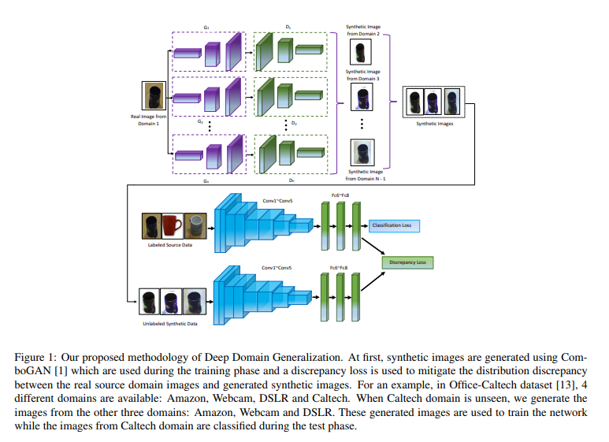

# MIT-DG
# Multi-component Image Translation for Deep Domain Generalization

The Link of the paper [Paper in IEEE](https://ieeexplore.ieee.org/document/8658643).

The Link of the paper [Paper in arxiv](https://arxiv.org/abs/1812.08974).

## Architecture





Please Cite:
```
@INPROCEEDINGS{8658643, 
author={M. M. {Rahman} and C. {Fookes} and M. {Baktashmotlagh} and S. {Sridharan}}, 
booktitle={IEEE Winter Conference on Applications of Computer Vision (WACV)}, 
title={Multi-Component Image Translation for Deep Domain Generalization}, 
year={2019}, 
```
